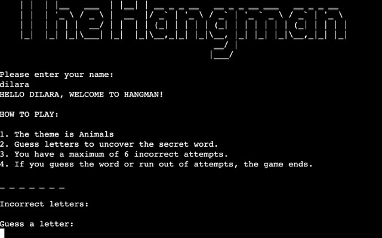
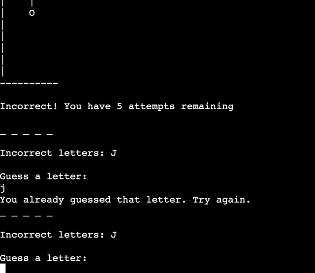
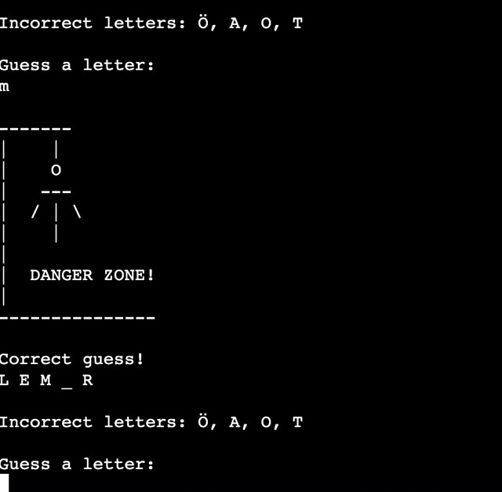
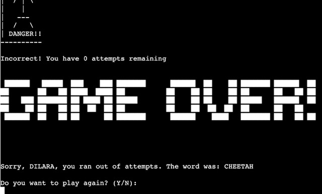
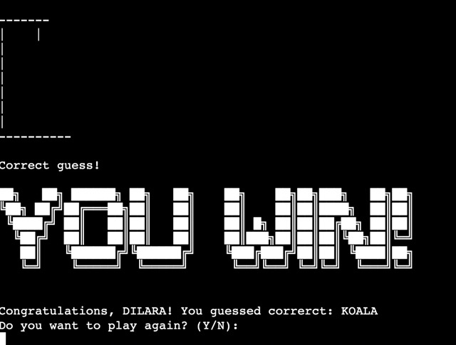
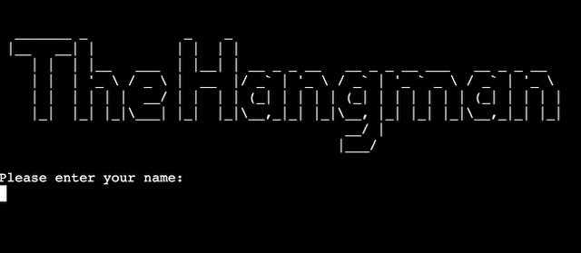

# THE HANGMAN GAME
The Hangman is a Python terminal based game, which runs in Code Institute mock terminal on Heroku.

A user can beat the game by trying to guess the correct word by following the game rules before they run out of attempts. Each incorrect answer adds to the hangman.

The live game can be found [here](https://the-hangman-game-p3-63bab5abcbcf.herokuapp.com/)

## How to play
In this version of the Hangman game, the user needs to put in there name and the game is then generated with a welcome message. 

First the user reads through the "How To Play" rules and can then start the game by guessing a letter. The user has 6 tries to guess the word by putting in correct letters. If not the user is notified with a message. The same letter can not be entered again and the user also gets notified if they do.

The user will also be notified if they have guessed correct letters and the world will be updated accordinly. If the player gets to close to losing the player will see the hangman with DANGER ZONE! underneath to make it clear that not many attempts to guess the word is left.

And lastly if user wins or looses its clearly printed on the screen with ASCII text art. The user is asked in the end if they would like to play again and then enter Y/N.

If the user chooses to play again they are then redirected to enter a name again and the game starts all over again. If they choose not to they are presented with the message: "Thanks for playing! Goodbye."

## Features
- The computer ramdomly selects a word from the words list. The player cannot see this word but is instead presented with underscores for the amount of letters there is in the selected word, and the correct letter inputs.

- The computer accepts user input and gives responsive feedback with input validation and handles error.

- User cannot enter a number, more than one letter, or the same letter twice and will be presented with a responsive feedaback message.

### Future Features
- Implementation of a game leaders so the players are saved to an external file and having a score system.

- Have different themes the player can choose from. Right now the theme is only animals.

- Have a difficulity option where the player can choose what level of difficulity they desire.

## Testing
I have manually tested this project by doing the following:
- Giging invalid inputs to make sure the input validation is working correctly.
- Tested in my gitpod terminal and also in the Code Institute Heroku terminal
- Passed the code through a [PEP8 Python Validator.](https://pep8ci.herokuapp.com/#)

### Bugs
#### Solved Bugs
- I had trouble with the ASCII art showing up weird in console. I fixed this by using Raw Strings consisting of an 'r' before the opening quote. I found this problem solver in [this website](https://realpython.com/python-hangman/#step-5-draw-the-hanged-man).

- I had problems with adding space between two strings. In those cases i added print statements between and that fixed the problem.

#### Unsolved Bugs
- No unsolved bugs remaining.

## Deployment
Steps taken to deploy project to Heroku:
- Commit and push all code to GitHub from GitPod.
- Create an [Heroku](https://heroku.com) account.
- Press on Create New App.
- Add name to your app and choose your region.
- Navigate to settings and add Conf Vars PORT 8000 and Buildpacks Python and Node.js.
- Navigate to deploy on the top of the page and search github repo and the connect.
- Then at the bottom deploy from branch and wait for everything to load.
- Open live page and made sure no errors occured.

## Credits